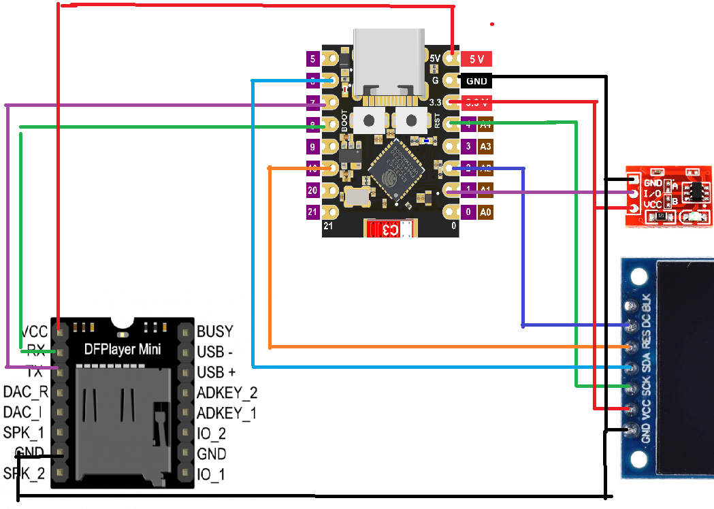
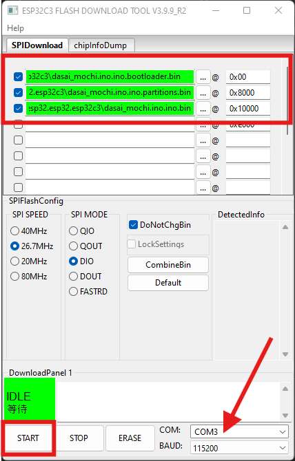

# ESP32-C3 Mini + TFT ST7789 + DFPlayer Mini + TTP223

Dự án này minh họa cách **đấu nối phần cứng** giữa vi điều khiển **ESP32-C3 Super Mini**, màn hình **TFT ST7789 240×240**, module phát nhạc **DFPlayer Mini**, và cảm biến chạm **TTP223**.

---

## Sơ đồ kết nối

### ESP32-C3 Mini → TFT ST7789
| ESP32-C3 Pin | TFT Pin  | Ghi chú |
|--------------|----------|---------|
| GPIO6        | MOSI     | Dữ liệu SPI |
| GPIO4        | SCLK     | Clock SPI |
| GPIO2        | DC       | Data/Command |
| GPIO10       | RST      | Reset |
| 3.3V         | VCC      | Nguồn 3.3V |
| GND          | GND      | Mass |

---

### ESP32-C3 Mini → DFPlayer Mini
| ESP32-C3 Pin | DFPlayer Pin | Ghi chú |
|--------------|--------------|---------|
| GPIO8        | RX           | Gửi dữ liệu đến DFPlayer |
| GPIO7        | TX           | Nhận dữ liệu từ DFPlayer |
| 5V           | VCC          | DFPlayer cần 5V để hoạt động ổn định |
| GND          | GND          | Mass |

---

### ESP32-C3 Mini → Nút điều khiển
Người dùng có **2 lựa chọn**, **chỉ dùng 1 trong 2**:

#### 1. ESP32-C3 Mini → TTP223
| ESP32-C3 Pin | TTP223 Pin | Ghi chú |
|--------------|------------|---------|
| GPIO1        | OUT        | Ngõ ra cảm ứng |
| 3.3V         | VCC        | Nguồn 3.3V |
| GND          | GND        | Mass |

#### 2. Dùng nút nhấn cơ bình thường
| ESP32-C3 Pin | Button Pin | Ghi chú |
|--------------|------------|---------|
| GPIO1        | Một chân   | Nối thẳng vào GPIO1 |
| GND          | Chân còn lại |  |

---

## Lưu ý khi đấu nối
- **Nguồn cấp**:  
  - ESP32-C3 Mini chạy tốt ở 5V (qua USB) hoặc 3.3V trực tiếp.  
  - TFT ST7789 dùng 3.3V.  
  - DFPlayer Mini **ưu tiên 5V** để âm thanh ổn định.  
  - TTP223 dùng 3.3V.  

- **Mass chung**: tất cả GND của các module **phải nối chung**.

- **Loa**: có thể nối trực tiếp loa nhỏ vào `SPK1/SPK2` của DFPlayer Mini, hoặc dùng ngõ `DAC_R`/`DAC_L` qua mạch khuếch đại rời.

---

## Sơ đồ tham khảo

---
## Cài đặt FW

---
## Cấu Trúc Thư mục SD
- 1 / chứa âm thanh cảm cảm : 0.mp3 -> 6.mp3
- 2 
- 3
- 4 / Thư mục chứa nhạc. tên từ 000.mp3 -> 999.mp3

---
## Sau Cài đặt
### Cấu hình tên bài hát
#### dùng lệnh serial
- mỗi bài hát cách nhau dấu phẩy.
- <code>set_tracks: bài 1, bài 2</code>
>

## Thư viện Arduino cần cài
- [TFT_eSPI](https://github.com/Bodmer/TFT_eSPI) (cho màn hình TFT ST7789)  
- [DFRobotDFPlayerMini](https://github.com/DFRobot/DFRobotDFPlayerMini) (cho module DFPlayer Mini)  

---

## Tác giả
- Dự án ESP32-C3 Mini thử nghiệm với TFT, âm thanh MP3, và cảm biến chạm. 
